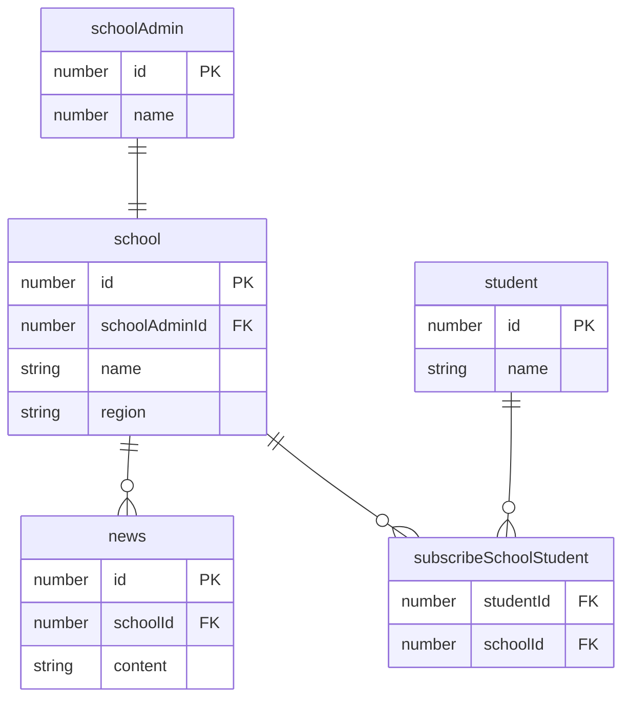

<p align="center">
  <a href="http://nestjs.com/" target="blank"></a>
</p>

[circleci-image]: https://img.shields.io/circleci/build/github/nestjs/nest/master?token=abc123def456
[circleci-url]: https://circleci.com/gh/nestjs/nest

  <p align="center">A progressive <a href="http://nodejs.org" target="_blank">Node.js</a> framework for building efficient and scalable server-side applications.</p>
    <p align="center">
<a href="https://www.npmjs.com/~nestjscore" target="_blank"></a>
<a href="https://www.npmjs.com/~nestjscore" target="_blank"></a>
<a href="https://www.npmjs.com/~nestjscore" target="_blank"></a>
<a href="https://circleci.com/gh/nestjs/nest" target="_blank"></a>
<a href="https://coveralls.io/github/nestjs/nest?branch=master" target="_blank"></a>
<a href="https://discord.gg/G7Qnnhy" target="_blank"></a>
<a href="https://opencollective.com/nest#backer" target="_blank"></a>
<a href="https://opencollective.com/nest#sponsor" target="_blank"></a>
  <a href="https://paypal.me/kamilmysliwiec" target="_blank"></a>
    <a href="https://opencollective.com/nest#sponsor"  target="_blank"></a>
  <a href="https://twitter.com/nestframework" target="_blank"></a>
</p>
  <!--[](https://opencollective.com/nest#backer)
  [](https://opencollective.com/nest#sponsor)-->

## Description

학교 소식을 전달하고 받아보는 학교소식 뉴스피드를 위한 백엔드 구현

## Installation

```bash
# 의존성 설치를 해주세요.
$ yarn install
```

## Running the app

```bash
# docker로 데이터베이스 세팅을 해주세요.
$ docker-compose -f docker/docker-compose.yml up -d --build

# node version을 동일하게 사용하기 위한 nvm 세팅해주세요.
$ nvm install
$ nvm use

# watch mode running
$ yarn run start:dev
```

Dotenv 세팅을 위해 .envrc.sample 을 .envrc 파일로 변경하고 `direnv allow` 명령어를 호출해주세요.

## ERD


## 구현 기능

1. 학교 관리자 생성 및 목록 조회

학교 관리자를 생성하고 모든 학교 관리자를 조회할 수 있는 간단한 API입니다.

```
학교 관리자를 생성할 수 있는 API
POST /school-admins
{
  name: string
}

생성된 모든 학교 관리자를 조회할 수 있는 API
GET /school-admins
```

1-1. 학교 관리자 로그인

학교 관리자 로그인 기능입니다. 편의상 refreshToken과 토큰 재발행 기능은 개발하지 않고, accessToken 만 생성합니다.

```
학교 관리자 로그인 API
POST /auth/login/school-admins/:schoolAdminId

로그인 후 이용할 수 있는 서비스 : 학교 페이지 API, 학교 소식 API
```

2. 학교 페이지 생성 및 목록 조회

학교 관리자 로그인 후 학교 페이지 생성 및 모든 학교를 조회할 수 있는 간단한 API입니다.

```
학교를 생성할 수 있는 API
POST /schools
{
  name: string,
  region: string
}

생성된 모든 학교를 조회할 수 있는 API
GET /schools
```

3. 학교 관리자가 학교 페이지에 소식 작성, 수정, 삭제

학교 관리자가 학교 페이지에 소식을 생성하고 수정, 삭제하는 기능입니다.

```
학교 소식을 생성할 수 있는 API
POST /schools/:schoolId/news
{
  content: string,
  schoolId: number
}

생성된 모든 소식을 조회할 수 있는 API
GET /schools/:schoolId/news

특정 소식 내용을 수정할 수 있는 API
PUT /schools/:schoolId/news/:newsId
{
  content: string
}

특정 소식을 삭제할 수 있는 API
DELETE /schools/:schoolId/news/:newsId
```

4. 학생 생성 및 목록 조회

학생을 생성하고 모든 목록을 조회하는 기능입니다.

```
학생을 생성할 수 있는 API
POST /students
{
  name: string
}

생성된 모든 학생을 조회할 수 있는 API
GET /students
```

4-1. 학생 로그인

학생 로그인 기능입니다. 마찬가지로 refreshToken과 토큰 재발행 기능은 개발하지 않고, accessToken 만 생성합니다.

```
학생 로그인 API
POST /auth/login/students/:studentId

로그인 후 이용할 수 있는 서비스 : 뉴스피드 API, 구독 API
```


5. 학생의 학교 구독 및 구독한 학교, 소식 목록 조회, 구독 취소 (최신순 노출)

로그인한 학생의 학교 페이지 구독과 구독한 학교 목록 조회 및 해당 학교의 소식 목록를 조회하는 기능입니다. 또한 구독 취소를 할 수 있습니다.

```
학생이 학교 페이지 구독하는 API
POST /subscribe/schools
{
  schoolId: string
}

학생이 구독중인 학교 페이지 목록을 조회하는 API
GET /subscribe/schools

학생이 학교 페이지 구독 취소하는 API
DELETE /subscribe/schools

학생이 구독한 학교 페이지의 뉴스피드 목록 조회하는 API
GET /subscribe/schools/news
```

6. 학생이 구독중인 학교 소식 뉴스피드 조회

학생의 뉴스피드 조회 기능입니다. 구독한 모든 학교의 소식을 최신순으로 조회할 수 있습니다.

```
뉴스피드 목록 조회하는 API
GET /news-feed
```

## API DOCS (Swagger)

실행 후 http://localhost:3000/api/docs

## Test

테스트코드는 학교, 학교 관리자, 학생, 소식 생성 기능에 대한 unit 테스트코드를 작성했습니다.
가능하다면 추후 다른 기능에 대한 테스트코드를 추가할 예정.

```bash
# unit tests
$ yarn run test

# test coverage
$ yarn run test:cov
```


## Support

Nest is an MIT-licensed open source project. It can grow thanks to the sponsors and support by the amazing backers. If you'd like to join them, please [read more here](https://docs.nestjs.com/support).

## Stay in touch

- Author - [Kamil Myśliwiec](https://kamilmysliwiec.com)
- Website - [https://nestjs.com](https://nestjs.com/)
- Twitter - [@nestframework](https://twitter.com/nestframework)

## License

Nest is [MIT licensed](LICENSE).
